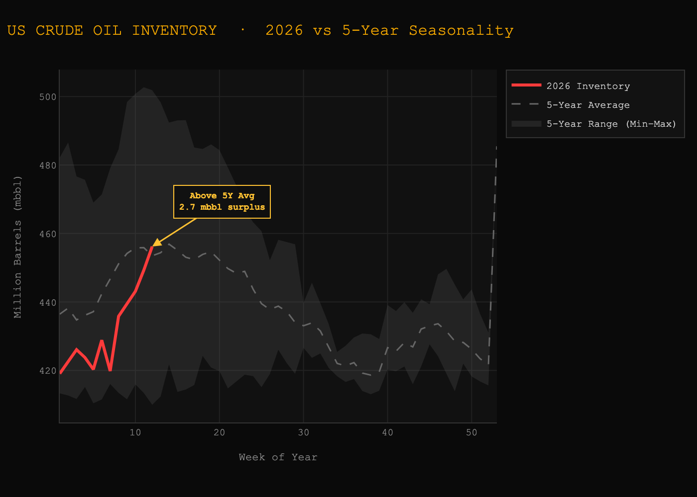
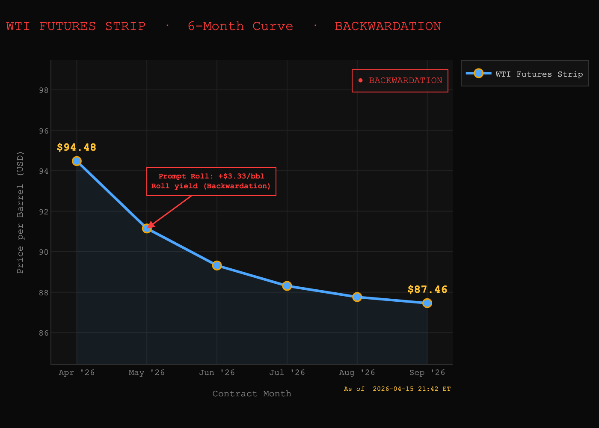
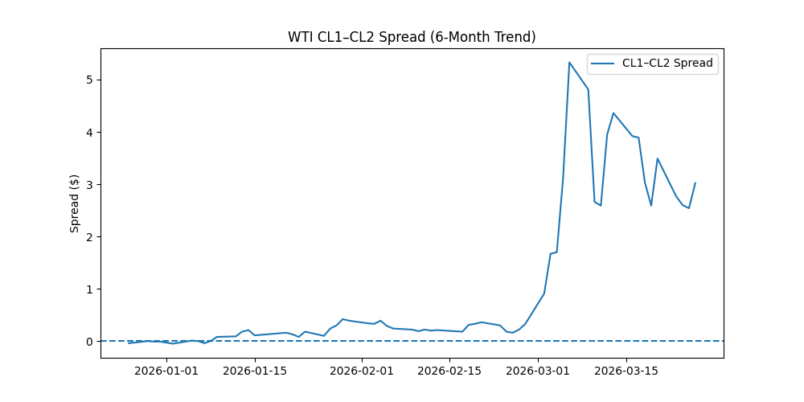

# Weekly Crude Oil Market Brief — 03/26/2026

## Key Metrics
- Inventory Level: 443.103 mb
- Weekly Change: 3.824 mb
- Seasonal Avg: 2.005 mb
- Inventory Surprise: 1.820 mb → **SIGNAL**
- CL1–CL2 Spread: 3.020 → **Curve Structure**

---

## Market Structure View
- Inventory: Bearish inventory surprise (build vs seasonal) 
- Curve: Extreme Backwardation (CL1–CL2: 3.02). Current levels represent the highest backwardation observed in the past 12 months.
- Combined: BULLISH DIVERGENCE -> Physical tightness overriding inventory builds (Supply of oil barrels increase and paradoxically price of oil also increased.)

---

## Key Insight (The "So What?")
A front-month spread approaching $3.00 signals extreme prompt tightness, consistent with emergency supply conditions in the physical market. This level of backwardation 99th percentile is historically associated with acute supply dislocations and aggressive physical bidding behavior.

---

## Trade Idea
Long WTI and long roll (CL1–CL2) —> capture extreme backwardation carry. In a market with a $2.96 spread, the price of the oil itself (flat price) almost becomes secondary to the massive "rent" you collect just for holding the position.

### Trade Rationale
The current Bullish Divergence indicates that while headline EIA data shows an inventory build, the physical market is "starved" for immediate delivery. Refineries and end-users are paying a record premium to secure "wet" barrels today to bypass logistical friction and geopolitical uncertainty. This physical panic creates a "floor" under the front-month price which is underestimated usually. Being long is a "disaster hedge" if a supply event occurs, the front month will moon-shot significantly faster than the deferred months, leading to exponential gains in the spread value.

---

## Roll Yield Insight
Positive Roll Yield (The "Carry"): In extreme backwardation, the front-month contract (CL1) is priced significantly higher than the second-month (CL2). As time passes and CL1 approaches expiry, it "rolls" toward the spot price. By being long, you are capturing this structural price decay of the forward curve. At a $2.96 spread, you are earning an implied "yield" of roughly 3% per month simply by holding the position, providing a massive buffer against small downward moves in the flat price.

---

## Risk / Failure Scenario
A sudden geopolitical de-escalation/opening of major trade way or a large inventory build (>5 mb) while divergence is gone would indicate that oil prices are going to fall tremedously crushing the spread causing us to lose money but control the downside by tight stop-loss and constant monitoring of data and news. This would invalidate the bullish thesis.

---

## Market Drivers (Macro / Geopolitical)
- Geopolitics: Tension between US/Isreal and Iran. Irans attack on neighboring Middle Eastern countries and restriction of major trade way (strait of hormouz)
- Strategic Petroleum Reserve (SPR) Refill Policy: The US Department of Energy (DOE) has shifted from "selling" to "aggressively buying" to replenish the SPR following the recent price dip. This adds to the competition with private refinaries for the same physical barrels thereby worsing the backwardation.
- Asian Refinery Re-Opening: Major Chinese and Indian refineries have completed their spring maintenance cycles earlier than expected. This has triggered a massive "pull" for US export grades (WTI Midland), causing a logistical drain at Gulf Coast export terminals that isn't yet fully reflected in the inland Cushing inventory builds.

---

## Charts

### 1. Inventory vs Seasonal Range

### 2. WTI Futures Curve

### 3. CL1–CL2 Spread (6M Trend)
