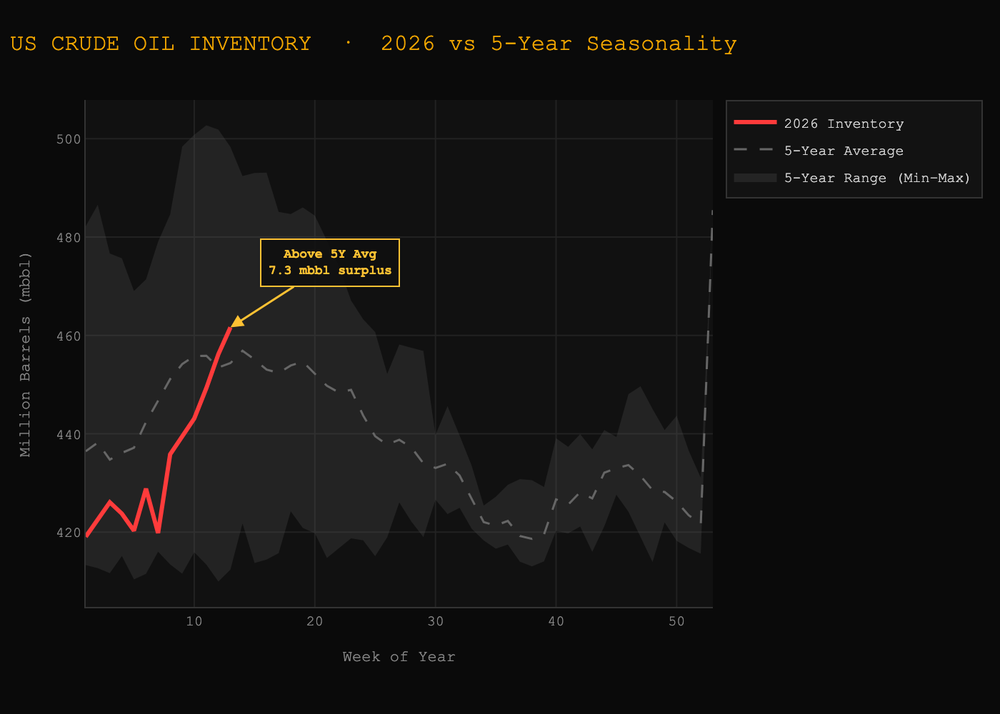
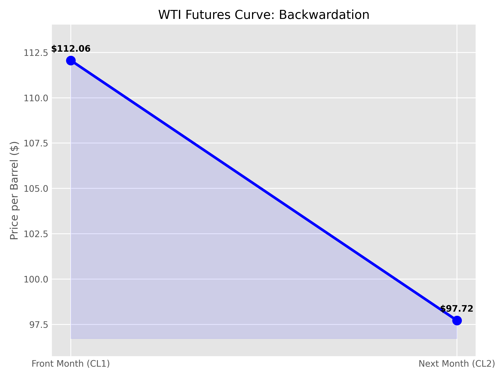
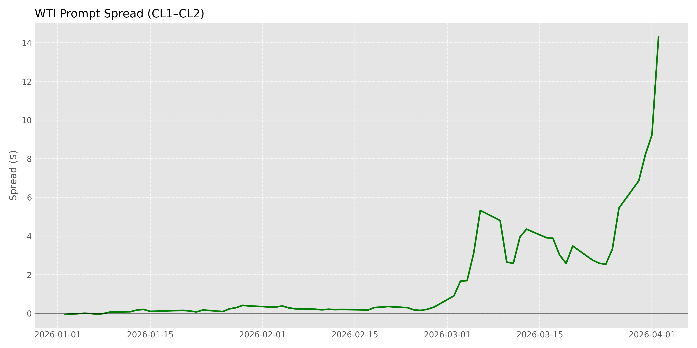

# Weekly Crude Oil Market Brief — 04/02/2026

## Key Metrics
- Inventory Level: 443.103 mb
- Weekly Change: 3.824 mb
- Seasonal Avg: 2.005 mb
- Inventory Surprise: 1.820 mb → **SIGNAL**
- CL1–CL2 Spread: 14.340 → **Curve Structure**

---

## Market Structure View
- Inventory: Bearish inventory surprise (build vs seasonal) 
- Curve: Extreme Backwardation (CL1–CL2: 14.340). Current levels represent one of the highest backwardation observed in history (levels seen in war times and major pipeline failures) structural dislocation in prompt market.
- Combined: BULLISH DIVERGENCE -> Physical tightness overriding physical market completely overriding inventory data

---

## Key Insight (The "So What?")
A front-month spread exceeding $14 represents a severe structural breakdown in the futures curve, far beyond typical backwardation regimes.It suggests that while there is oil in storage tanks, it is either in the wrong place, the wrong grade, or being held by people who are unwilling to sell it due to extreme supply risk.
- This level of dislocation signals:
1. Acute shortage of immediately deliverable barrels
2. Aggressive physical bidding for prompt crude
3. Breakdown of normal storage/arbitrage relationships
Price Volatility: Expect sharp, erratic price moves. The market is trading on supply risk and logistics stress rather than steady supply-and-demand.

---

## Trade Idea
Long WTI and long roll (CL1–CL2) —> capture extreme backwardation carry. In a market exceeding $14 spread, the price of the oil itself (flat price) almost becomes secondary to the massive "rent" you collect just for holding the position. Major refinearies are starving for oil and willing to pay premium

### Trade Rationale
The current Bullish Divergence indicates that while headline EIA data shows an inventory build, the physical market is "starved" for immediate delivery. 
Despite a bearish inventory build, the physical market is in panic mode: 
1. Front-month crude is trading at an unprecedented premium (refineries paying out of pocket for wet barrel)
2. Buyers are prioritizing immediate access over price
3. The curve indicates tightness that inventory data is not capturing
The divergance suggests inventory builds are misleading (oil not reach consumer) and the real constraint is availability of deliverable barrels.

---

## Roll Yield Insight
Positive Roll Yield (The "Carry"): In extreme backwardation, the front-month contract (CL1) is priced significantly higher than the second-month (CL2). As the contract approaches expiry, this premium naturally decays, generating a systematic roll yield for long positions. By being long, you are capturing this structural price decay of the forward curve. At over $14 spread, the implied carry is extraordinarily elevated far beyond normal market conditions transforming the trade from a directional bet into a carry-driven strategy.

This means:
Even in a flat price environment, the position can generate returns through curve convergence
The carry acts as a downside buffer, offsetting moderate adverse price moves
The trade becomes structurally attractive due to market dislocation, not just price direction

---

## Risk / Failure Scenario
This trade is highly dependent on the persistence of physical tightness and geopolitical risk premiums, and therefore carries asymmetric downside risk if conditions normalize.
Key scenarios:
1. Rapid geopolitical de-escalation: Any diplomatic breakthrough or easing of tensions in the Middle East particular between US and Iran easing trade through Strait of Hormuz could immediately compress the risk premium.
2. A normalization of shipping activity would alleviate the immediate scarcity of deliverable barrels, leading to a sharp flattening of the futures curve.
3. Significant inventory builds (>5–7 mb):
A large and sustained increase in inventories, especially at key hubs such as Cushing, would signal that supply constraints are easing and invalidate the divergence signal
4. Policy intervention (SPR release / OPEC response):
Emergency supply releases or coordinated production increases could rapidly rebalance the market.

---

## Market Drivers (Macro / Geopolitical)
-Strait of Hormuz Disruption: Severe disruption to a key global oil chokepoint (~20% of supply flows) has significantly constrained physical shipments, driving acute prompt scarcity.
-US vs Iran Escalation: Rising military tensions and lack of de-escalation signals have increased the geopolitical risk premium, with markets pricing in prolonged supply disruption.
-OPEC Supply Disruptions: War-related production and export constraints have reduced available supply, reinforcing structural tightness in the market (Iran drone attack on Kuwait tankers)
Refinery Demand + SPR Refill: Strong Asian refinery demand and U.S. SPR restocking are increasing competition for physical barrels, further tightening prompt supply.

---

## Performance (Strategy Tracking)
Last Week Return: +19.17%
Strategy Status: Correct Call (Bullish)
Portfolio Value: $11,917 (from $10,000 which is 10% of total portfolio)
Strong performance driven by:
Correct identification of backwardation regime and rolling yield expansion
Failure to de-escalate situations in Middle East and continued war with Iran

## Charts

### 1. Inventory vs Seasonal Range

### 2. WTI Futures Curve

### 3. CL1–CL2 Spread (6M Trend)
