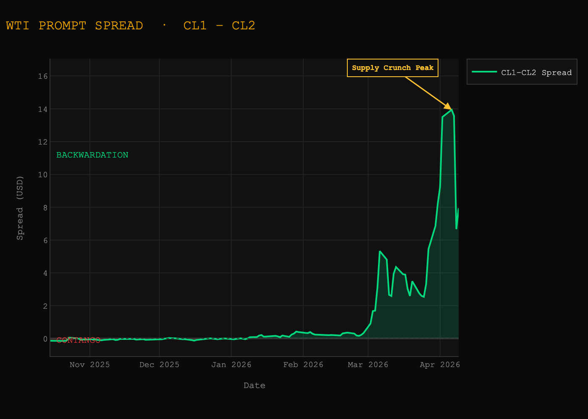
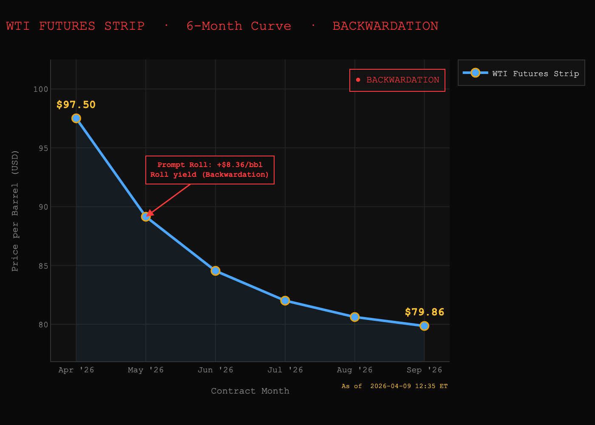
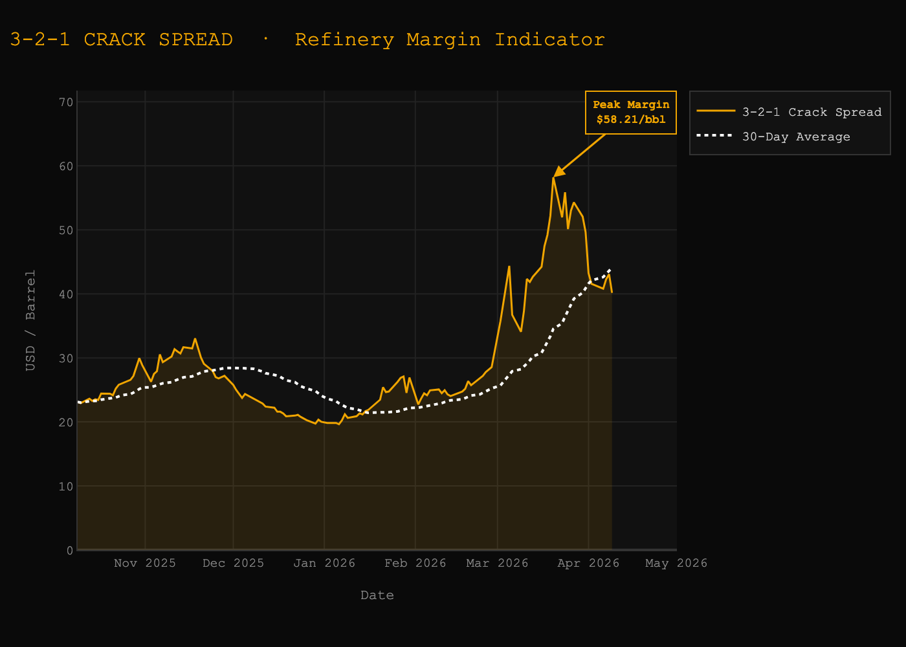
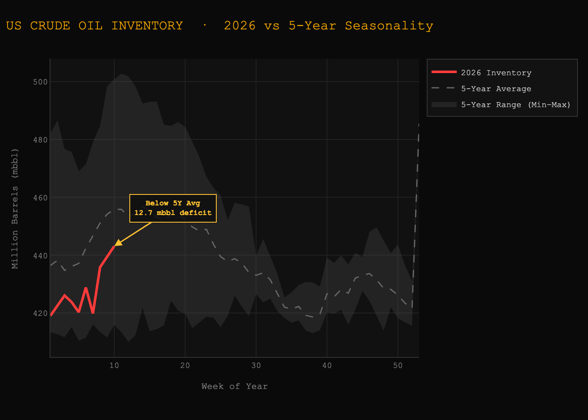
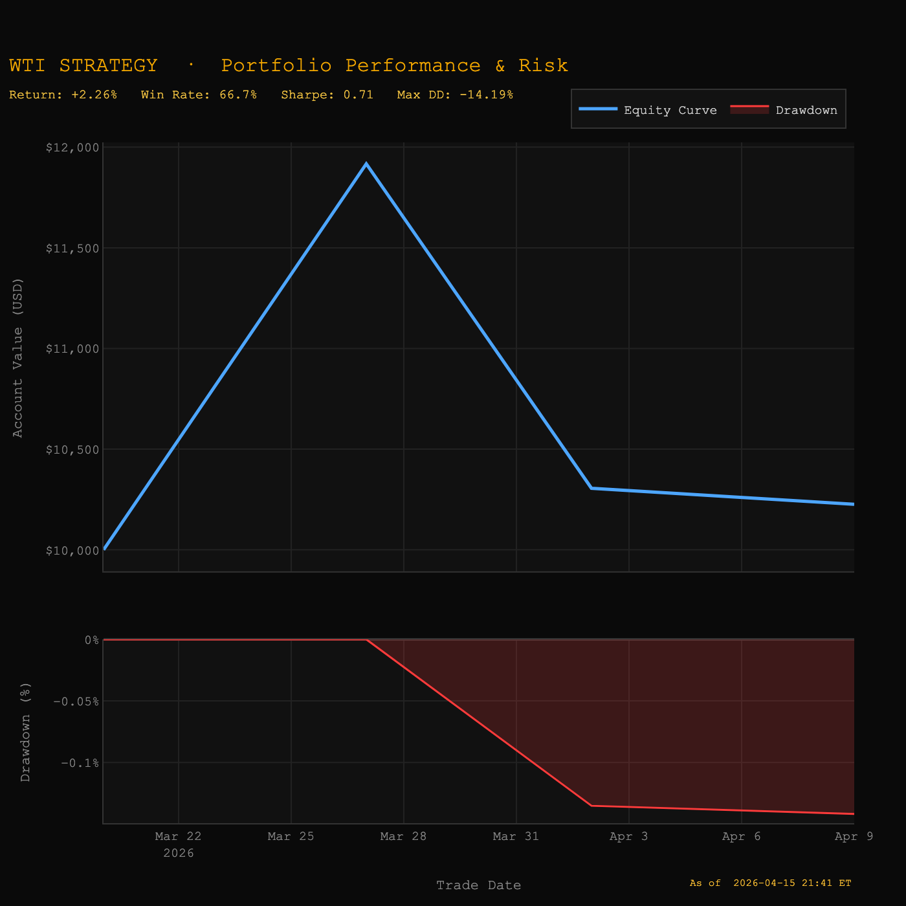

# WTI Crude Oil Market Brief — 04/09/2026  
## Regime Transition: Crisis Tightness → Normalization

---

## Executive Summary

The crude market is transitioning out of a **crisis-tightness regime** following a rapid compression in the prompt spread.

- CL1–CL2 peaked above **$14** → extreme dislocation  
- Spread has since compressed to **~$8 (-$5 move)**  
- Geopolitical de-escalation (ceasefire US vs Iran) is removing **risk premium** since Strait of Hormuz

**Key shift:**  
**Momentum is now dominating level**

---

## Market Structure

### Inventory
- Neutral signal  
- Build slightly above seasonal norms (7.9 mbbl), but not large enough to drive price independently  

---

### Futures Curve
- Still in **extreme backwardation (~$8)**  
- However:
  - **Momentum sharply negative**
  - Indicates **unwinding of stress**, not continuation  

---

### Refinery Demand (Cracks)
- Strong (~$38)  
- But:
  - No longer accelerating  
  - Suggests **demand is stabilizing**, not tightening further  

---

## Key Insight (The “So What?”)

The market is no longer pricing **scarcity escalation**  
→ it is pricing **normalization of risk**

This is a structural shift:

> From “How tight is supply?” → “How fast does the risk premium unwind?”

---

## What Changed?

Despite:
- Strong backwardation  
- Strong demand  

The market weakened because:

- Risk premium unwound rapidly  
- Spread momentum turned sharply negative  
- Event flow (ceasefire) altered forward expectations  

---

## Framework Shift

### Previous Assumption
Backwardation = bullish continuation  

### Updated Framework
**Level ≠ Signal**  
**Momentum + Regime = Signal**

---

## Regime Classification

- Prior: **Crisis Tightness**
- Current: **Weakening Tightness / Transition**
- Outlook: **Normalization phase**

---

## Trade View

### Positioning: LOW CONVICTION

- Reduce directional exposure  
- Avoid aggressive positioning  

---

### Decision Framework

**Bullish Re-entry Conditions**
- Spread stabilizes and re-expands (> $9–10)  
- Price holds above $90  
- Geopolitical risk re-escalates  

---

**Bearish Continuation Conditions**
- Spread compresses further (< $5)  
- Ceasefire holds / tensions ease  
- Curve flattens toward normal backwardation  

---

**Base Case**
Remain patient — wait for confirmation before re-entering  

---

## Risk Scenarios

### Downside (Bearish)
- Continued geopolitical de-escalation  
- Normalization of logistics and shipping  
- Full unwind of risk premium  

---

### Upside (Bullish)
- Breakdown of ceasefire  
- Strait of Hormuz disruption risk returns  
- Rapid re-expansion of prompt spread  

---

## Model Improvements

This week exposed key limitations in the initial framework.

### Previous Weaknesses
- Over-reliance on curve level  
- No adjustment for extreme dislocations  
- No momentum tracking  
- No event-driven override  

---

### Enhancements Implemented
- Regime classification (normal → tight → crisis → unwind)  
- Spread momentum tracking  
- Reversal detection logic  
- Geopolitical event overlay  

---

**Outcome:**  
Model now adapts to **structural shifts**, not just static signals  

---

## Performance Snapshot

- Win Rate: 50%  
- Sharpe Ratio: 0.88  
- Max Drawdown: -13.52%  
- CAGR: 132.98% *(early-stage, limited sample)*  

---

## Bottom Line

This is no longer a **trend market** — it is a **transition market**

> In transition regimes:  
> The edge is not in prediction  
> The edge is in patience  

---

## Charts

### 1. CL1–CL2 Spread (6M Trend)

### 2. WTI Futures Curve

### 3. Crack Spread (6M Trend)

### 4. Inventory vs Seasonal Range

### 5. Strategy Performance (Trade Signal Outcome)

---

## Final Report 
[Download Final Report (PDF)](../reports/2026-04-09.pdf)

